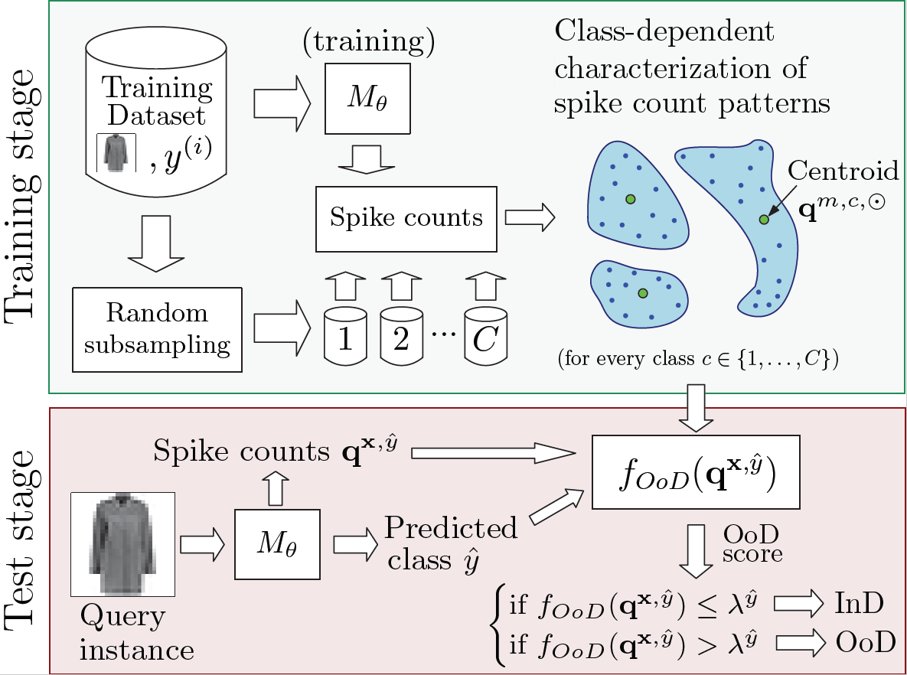
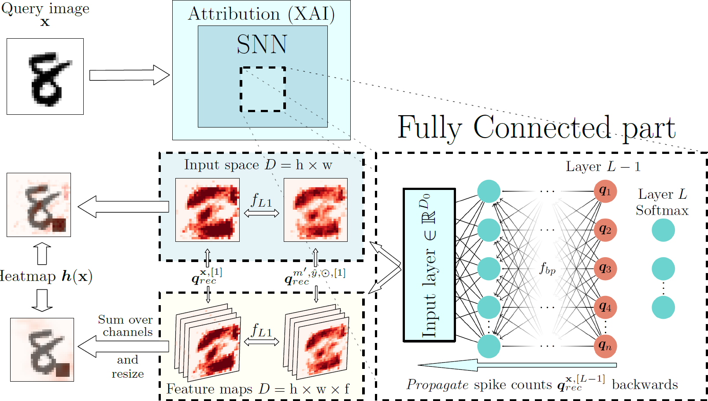

# Explainable Out-of-Distribution Detection Approach for Spiking Neural Networks

Repository containing the code and results for the paper *A Novel Explainable Out-of-Distribution Detection Approach for Spiking Neural Networks*. The paper is currently being evaluated is Neural Networks, but a preprint is available at https://arxiv.org/abs/2210.00894. 
Obtained results are available in the results folder.





## Requirements and dependencies

1. PyTorch 1.12.1 (vision 0.13.1) [https://github.com/pytorch/pytorch]
2. Norse 0.0.7 [https://github.com/norse/norse]
3. Other libraries typically included in mainstream Python distributions (NumPy, Pickle, Matplotlib, Pandas, scikit-learn, SciPy etc). There is a requirements.txt with the concrete libraries and versions.

To correctly install Norse locally, first install desired PyTorch version and then install Norse following the instructions at [the norse instalation guide and troubleshooting](https://norse.github.io/norse/pages/installing.html#installation-troubleshooting)

For the bayesian test and the CD graph, the following resources are used:
1. Orange3, version 3.30.0 [https://github.com/biolab/orange3]
2. [BayesianTestsML](https://github.com/BayesianTestsML/tutorial/blob/master/Python/bayesiantests.py) repository's bayesiantest.py


## Datasets

The majority of datasets is downloaded automatically, except for:

- [LSUN_Crop](https://www.dropbox.com/s/fhtsw1m3qxlwj6h/LSUN.tar.gz)
- [LSUN_Resize](https://www.dropbox.com/s/fhtsw1m3qxlwj6h/LSUN.tar.gz)

## Usage:

For reproducing results in GPU and with one FC hidden layer models, run:
````shell
python main.py --conf config --pretrained --arch-selector 1
````

For training:

````shell
CUDA_VISIBLE_DEVICES=0 python train.py --conf datasets --dataset CIFAR10 --model ConvNet --arch-selector 10 --f-max 200 -b 128 --lr 0.002 --epochs 75 --weight-decay 0.00001 --opt adamw --n-time-steps 64 --save-every 10  --lr-decay-milestones 10 20 25 30 --lr-decay-rate 0.8 --penultimate-layer-neurons 100
````
The name of the dataset must be the same as in the configuration file

For extracting metric plots:

````shell
python .\benchmark_metrics.py -c bw -r 0.01 -m all-subdirectories -d "path/to/dir" -cd -bs --metric AUROC --models ConvNet
````

There is also available an older version of the code in the jupyter notebook called [Explainable_OoD_detection_on_SNNs](https://github.com/aitor-martinez-seras/OoD_on_SNNs/blob/main/Explainable_OoD_detection_on_SNNs.ipynb), where instructions about how the algorithm works and how to execute it are provided.

## Contributing

If you find a bug, create a GitHub issue, or even better, submit a pull request. Similarly, if you have questions, simply post them as GitHub issues.

## Citing this work:

*Aitor Martinez Seras, Javier Del Ser, Jesus L. Lobo, Pablo Garcia-Bringas, Nikola Kasabov, "A Novel Explainable Out-of-Distribution Detection Approach for Spiking Neural Networks", under review, arXiv:2210.00894, 2022*

### Abstract

Research around Spiking Neural Networks has ignited during the last years due to their advantages when compared to traditional neural networks, including their efficient processing and inherent ability to model complex temporal dynamics. Despite these differences, Spiking Neural Networks face similar issues than other neural computation counterparts when deployed in real-world settings. This work addresses one of the practical circumstances that can hinder the trustworthiness of this family of models: the possibility of querying a trained model with samples far from the distribution of its training data (also referred to as Out-of-Distribution or OoD data). Specifically, this work presents a novel OoD detector that can identify whether test examples input to a Spiking Neural Network belong to the distribution of the data over which it was trained. For this purpose, we characterize the internal activations of the hidden layers of the network in the form of spike count patterns, which lay a basis for determining when the activations induced by a test instance is atypical. Furthermore, a local explanation method is devised to produce attribution maps revealing which parts of the input instance push most towards the detection of an example as an OoD sample. Experimental results are performed over several image classification datasets to compare the proposed detector to other OoD detection schemes from the literature. As the obtained results clearly show, the proposed detector performs competitively against such alternative schemes, and produces relevance attribution maps that conform to expectations for synthetically created OoD instances.

[[Link to the paper]](https://arxiv.org/abs/2210.00894)

```
@article{martinezseras22journal,
  title={{A Novel Explainable Out-of-Distribution Detection Approach for Spiking Neural Networks}},
  author={Seras, Aitor Martinez and Del Ser, Javier and Lobo, Jesus L. and Garcia-Bringas, Pablo and Kasabov, Nikola},
  journal={Under review, preprint available at arXiv},
  year={2022}
}
```